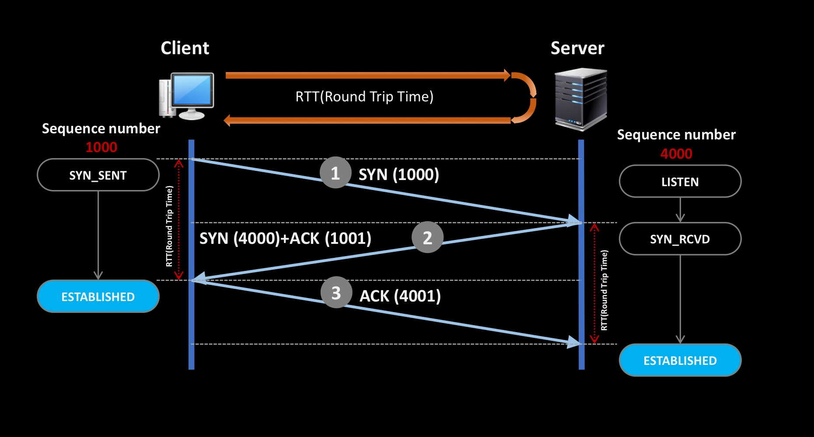
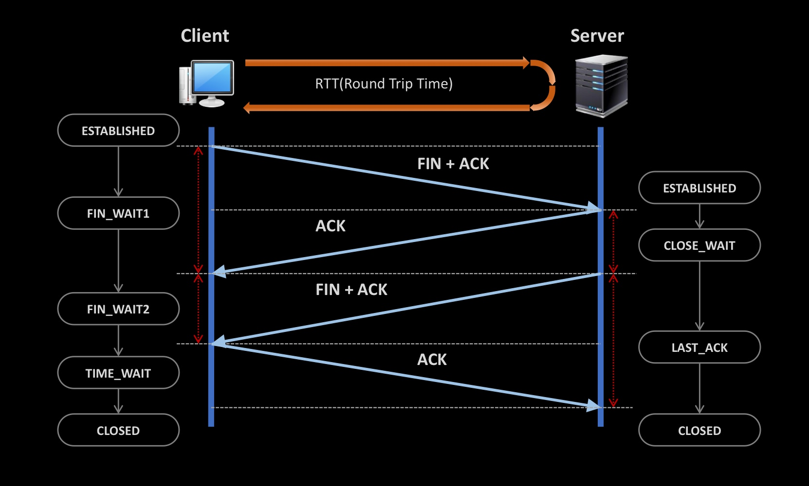

## 1. OSI 7 Layer

> 물데네트세프응

1. `L1 물리계층`
2. `L2 데이터링크 계층`: 같은 네트워크 안에서 어느 장비로 보낼지 확인한다. 이더넷이 사용됨.
3. `L3 네트워크 계층`: IP주소를 사용해서 목적지 컴퓨터까지 찾아간다.
4. `L4 전송 계층`: 컴퓨터 안에서 어떤 프로그램으로 보낼지 구분한다. TCP/UDP, Port 번호 사용.
6. `L5 세션 계층`
6. `L6 표현 계층`
7. `L7 응용 계층`

- 식별자
    - L2의 식별자 - **MAC 주소**: 랜카드(NIC)의 주소
    - L3의 식별자 - **IP주소**: (컴퓨터 자체)호스트의 주소
    - L4의 식별자 - **Port번호**: 컴퓨터 안에서 실행 중인 서비스나 프로그램의 번호

예:
> 192.168.0.10:8080
- 192.168.0.10 → 어떤 컴퓨터인가?
- 8080 → 그 컴퓨터의 어떤 프로그램인가?

Windows 명령어

```bash

ipconfig /all
```

### Host / Endpoint / Switch

- 호스트 = 네트워크와 연결된 컴퓨터. ex) PC, 스마트픈
- 스위치 = 엔드포인트의 사이에서 네트워크를 연결하고 데이터를 전달하는 장비. ex) L2 Switch, Router, L4 Switch
- 엔드포인트 = 네트워크를 사용하는 쪽.(클라이언트와 서버)

#### 네트워크를 고속도로로 비유하면

| 고속도로      | 네트워크        |
|-----------|-------------|
| 자동차       | 패킷          |
| 교차로       | 스위치 또는 라우터  |
| 목적지 주소    | 목적지 IP 주소   |
| 이정표       | 라우팅 테이블     |
| 길을 선택하는 기준 | 매트릭(Metric) |

- 교차로에서 이정표를 보고 경로를 선택함.
    - = 라우팅 테이블을 보고 Switching을 함.
    - MAC 주소를 보고 길을 선택하면 L2 Switch
    - IP 주소를 보고 길을 선택하면 L3 Switch
    - Port 번호를 보고 길을 선택하면 L4 Switch
    - HTTP 같은 프로토콜 정보를 보고 선택하면 L7 Switch

Windows 명령어
```bash

route print
```

---

## 2. L2 데이터링크 계층

> 데이터 단위는 **프레임**, 식별자는 **MAC**
> 
> 요약: NIC에 MAC 주소가 붙고, 이 장치를 통해 L2 프레임이 LAN 안에서 이동한다.

  - L2에서 사용하는 데이터 단위는 `프레임(Frame)`이다. 일반적인 프레임의 크기는 약 1500바이트이다.
- NIC(Network Interface Card): 컴퓨터를 네트워크에 연결하는 하드웨어. 
  - 하나의 NIC = 하나의 랜카드 = 식별자로 MAC 주소를 가짐.
- LAN은 가까운 범위의 네트워크를 말한다.
    - ex) 집의 공유기에 연결된 컴퓨터와 스마트폰들은 하나의 LAN을 구성한다.
- Gbps와 GB: b는 비트, B는 바이트를 의미한다.

### MAC 주소
- 8bit * 6개 = 48bit
- 16진수로 표현

예:
```text
00-1A-2B-3C-4D-5E
```

### LAN
- LAN(Local Area Network)는 가까운 범위에서 구성된 네트워크다.

예:

```text
        공유기
       /     \
     PC     스마트폰
```
- **LAN** → 집, 회사 등 비교적 작은 범위의 네트워크. 물리적 개념
- **WAN** → 여러 LAN을 연결하는 넓은 범위의 네트워크. 논리적 개념 ex) Internet

### L2 Access Switch

- 앤드포인트와 직접 연결되는 스위치.
- MAC 주소를 근거로 스위칭한다.

### L2 Distribution Switch

- L2 Access Switch를 위한 스위치.
- VLAN(Virtual LAN) 기능을 제공함.

> L2 Access 스위치 <====> L2 Distribution 스위치 <====> L2 Access 스위치


---

## 3. L3 네트워크 (패킷, IP 주소)
> 데이터 단위는 **패킷**, 식별자는 **IP 주소**

### L3 IP 패킷

> Header / Payload로 구성

- 최대 크기는 **MTU** 보통 대략 1500byte
- Header: 출발지, 도착지 정보
- Wireshark 로 패킷을 볼 수 있음.


### IPv4 주소의 구조

- 8bit * 4 = 32bit. 10진수로 표현.
- 8비트는 0~255숫자 가능하므로: 
    - IP주소는 `0.0.0.0` ~ `255.255.255.255` 가능.
- `192.168.0`.`10` = `1100 0000`.`1010 1000`.`0000 0000`.`0000 1010`
    - **Network ID**: (24bit) `192.168.0`까지 네트워크 아이디. 네트워크 아이디를 보고 어느 네트워크로 가야하는지 판단한다.
    - **Host ID**: (8bit) `10`은 호스트 아이디. 네트워크에 도착한 뒤 호스트 아이디를 이용해 그 네트워크 안에서 어느 컴퓨터로 가야하는지 판단한다.

### 서브넷 마스크
- **서브넷 마스크**를 통해 패킷이 **우리 네트워크로 유입되는지 판단**할 수 있다.
- 서브넷 마스크 : `255.255.255.0`


| 목적지 IP 주소 | 192.168.0.10                                   |
|-----------|------------------------------------------------|
| 2진수       | `1100 0000` `1010 1000` `0000 0000` `0000 1010` |
| 서브넷 마스크   | `1111 1111` `1111 1111` `1111 1111` `0000 0000` |
| AND 연산 결과 | `1100 0000` `1010 1000` `0000 0000` `0000 0000` |
| 결과 10진수   | `192.168.0.0`    (결과값과 자신의 네트워크 ID와 비교)         |


- 목적지 IP 주소와 서브넷 마스크를 AND 연산한 값과 네트워크 ID를 비교하여 경로를 판단한다.

### CIDR(Classless Inter-Domain Routing)

- IP 주소 32비트 중 어느 부분이 Network ID인가 구분하는 방법.
- 원래는 클래스 A,B,C를 보고 IP 주소에서 Network ID를 잘라냈다.
- 지금은 클래스 없이 사용하는 CIDR를 사용한다.
- `192.168.0.10/24`에서 `/24` 이 부분이 CIDR이다.
- 앞의 24bit를 Network ID로 사용한다는 의미이다.


### Broadcast IP 주소
- Unicast : 한 장비에서 특정 장비로 전송. A → B
- Broadcast : 같은 Broadcast Domain 안의 모든 장비로 전송. A → 모두
  - 브로드캐스트가 전송될 동안 다른 통신이 불가능해지므로 효율성이 떨어진다. 그래서 브로드캐스트의 사용은 최소화해야 함.
- Broadcast를 위한 IP 주소, MAC 주소가 지정되어 있음.
- IP 주소에서 Host ID로 0과 255는 사용 불가능해서 실제로 사용할 수 있는 Host ID는 255개보다 적다.

```text
예: 192.168.0.10/24

Broadcast MAC 주소는 항상 : `FF-FF-FF-FF-FF-FF`

192.168.0.0/24의 Broadcast IP 주소 : 192.168.0.255
192.168.1.0/24의 Broadcast IP 주소 : 192.168.1.255

사용 가능한 Host: 192.168.0.1 ~ 192.168.0.254
```


### 127.0.0.1 IP 주소
- 컴퓨터 자신을 가르키는 IP 주소를 루프백 주소라고 한다. `127.0.0.1`
- 같은 컴퓨터 안의 프로세스끼리 통신할 때 사용한다.
- 루프백 통신은 컴퓨터 내부에서만 통신하며, 외부 네트워크로 나가지 않는다.


### MTU와 MSS
- MTU(Maximum Transmission Unit) : 최대 전송 단위. 한 번에 전달할 수 있는 IP 패킷의 최대 크기. 일반적으로 1500 Byte.
- MSS(Maximum Segment Size) : TCP Segment의 최대 크기. Application Data가 MSS보다 크면 여러 개로 자른다. 

```text
MTU       1500
IP Header   20
TCP Header  20
----------------
MSS       1460 Byte
```

### Gateway
- Gateway는 내 네트워크 밖으로 나갈 때 거쳐 나가는 출구다. 내 PC가 외부 서버와 통신하려면 먼저 Gateway로 데이터를 전달한다.
예:
```text
PC: 192.168.0.10
       ↓
Gateway: 192.168.0.1
       ↓
Internet
```

### ARP (Address Resolution Protocol)
- ARP는 IP 주소로 MAC 주소를 알아낼 때 사용되는 프로토콜이다.
- Gateway의 MAC 주소 알아낼 때 ARP를 사용한다.
  - 인터넷 통신에선 게이트웨이의 MAC 주소를 반드시 알아야 한다.
  - PC는 DHCP를 통해 Gateway의 IP 주소를 전달받는다.
  - 이 IP 주소를 가지고 APR Request를 브로드캐스트로 전송하면 Gateway가 MAC 주소를 응답한다.
  - L2 Frame의 목적지 MAC 주소를 Gateway의 MAC 주소로 셋팅한다.

Windows 명령어:
```bash

arp -a
```


### DHCP
- 인터넷을 사용하기 위해선 여러 네트워크 설정이 필요하다.
  - IP 주소
  - 서브넷 마스크
  - Gateway IP 주소
  - DNS 주소 등
- **DHCP**(Dynamic Host Configuration Protocol)는 복잡한 네트워크 설정을 자동으로 처리해주는 프로토콜이다.
- 보통 가정에선 공유기가 DHCP 서버 역할을 한다.
- 처음에 브로드캐스트를 통해 DHCP 서버와 연결을 해야 하므로 브로드캐스트 도메인 안에 DHCP 서버가 있다.

#### < DHCP 서버를 통해 자동 설정을 하는 과정 >
1. 나의 컴퓨터가 네트워크에 연결되면, 나의 컴퓨터가 브로드캐스트로 DHCP 서버를 찾는다.
2. 나의 컴퓨터가 사용할 IP 주소와 네트워크 설정을 요청한다.
3. DHCP 서버가 IP 주소, 서브넷 마스크 등 필요한 정보를 보내준다.
4. 그 정보로 네트워크 설정이 자동으로 적용된다.


### IP 헤더 형식
- IP 헤더는 기본적으로 **20바이트**이며, 패킷의 전체 크기는 MTU의 영향을 받는다.
  - MTU는 보통 1500 Byte.
- 주요 헤더 필드
  - IP 버전
  - 헤더 길이
  - 전체 길이
  - 단편화
  - TTL
  - Protocol : TCP,UDP,ICMP 등 프로토콜을 나타냄.
  - checksum : 데이터 손상 여부 검사
  - 출발지, 목적지 IP 주소

#### TTL(Time To Live)
- 패킷이 라우터를 지날 때마다 TTL은 1 감소하고, 0이 되면 패킷이 소멸된다.
  - 라우터를 한 번 지나는 단위를 Hop이라고 한다. 즉 Hop을 지날때마다 TTL이 1 감소한다.
  - TTL을 통해 패킷의 무한 순환을 막는다.

### 단편화(Fragmentation)
= 패킷 쪼개기

- 경로 상의 네트워크의 MTU보다 패킷의 크기가 크면? 패킷을 MTU에 맞게 여러 패킷으로 나눈 후 전송한다.
- 수신 측에서 다시 하나의 패킷으로 조립한다.
- MTU가 1500바이트보다 작은 경우는 거의 없어서 단편화가 발생할 일은 드물다. VPN, Tunnel 등을 사용하면 단편화가 발생하기도 한다.

### Ping과 RTT
- Ping은 대상 컴퓨터까지 네트워크 통신이 가능한지 확인하는 명령어다.

```bash

ping 8.8.8.8
```
- 주로 ICMP 프로토콜을 사용한다.
- Ping으로 RTT(Round Trip Time)을 확인할 수 있다.
  - RTT(Round Trip Time) : 대상 호스트까지 갔다가 되돌아오는 왕복 시간. RTT가 길수록 응답이 느림.
- 인터넷이 안될 때 게이트웨이에 Ping을 보내 응답이 오는지 확인할 수 있다.
- Ping을 과도하게 보내 서버의 자원을 소모시켜 서비스가 정상 동작을 하지 않는 것 = Dos 공격

### 네트워크 장애
1. 데이터 유실(Loss): 패킷이 중간에서 유실된 상태

2. Retransmission(재전송) : 데이터를 받았다는 응답이 없으면 송신 측에서 해당 데이터를 다시 재전송한다.
3. ACK 중복 : 수신측에서 같은 ACK을 여러 번 보내는 상황. 중간 Segment가 유실되었을 가능성을 판단할 수 있다.
4. Out of Window: 패킷이나 TCP Segment가 전송된 순서와 다르게 도착한 상태.
5. Zero Window : 수신측의 버퍼가 가득차서 데이터를 더 받을 수 없는 상태.
   - 수신측은 ACK을 통해 데이터를 받았다는 것과 현재 남은 버퍼 상태(window size)를 송신측에 응답한다. 송신측은 해당 window size를 고려해 전송량을 조절한다.
   - window size가 0이면 zero window 발생.


### 정리
- L4 전송 계층. TCP Segment. Port 번호 추가
- L3 네트워크 계층. IP 패킷. IP 주소 추가
- L2 데이터링크 계층. Ethernet Frame. MAC 주소 추가

```text
MAC Address = 같은 LAN에서 어떤 장비? 현재 구간에서 다음 장비를 찾기 위함.
IP Address = 네트워크에서 어떤 호스트? 최종 목적지 찾기 위함.
Port = 그 호스트의 어떤 프로그램? 목적지 컴퓨터 안에서 프로그램을 찾기 위함.
```

#### 네트워크 장비
```text
L2 Switch => MAC 주소 확인
Router => IP 주소 확인
```

---

## 4. L4 전송(Transport)
> 데이터 단위는 **TCP Segemnt**, UDP Datagram. 식별자는 **Port 번호**

### TCP와 UDP

|       | TCP                         | UDP                       |
|-------|-----------------------------|---------------------------|
| 특징    | 연결, 순서, 상태를 관리하는 신뢰성 중심의 통신 | 연결없이 빠르게 보내는 통신           |
| 연결    | 연결 후 통신                     | 연결없이 바로 통신                |
| 순서 관리 | 데이터 조각에 순서번호를 붙여 순서를 관리함    | X                   |
| 상태 관리 | 통신 전, 통신 중 등 상태관리를 함        | X                   |
| 재전송   | O                           | X                   |
| 흐름제어  | O                           | X                   |
| 혼잡제어  | O                           | X                   |

### TCP 연결 - 3-Way Handshake
TCP는 데이터를 보내기 전에 상대방과 논리적인 연결 상태를 만든다.



쉽게 표현하면:
```text
Client : 연결할래?
Server : 좋아. 나도 준비됐어.
Client : 확인했어. 연결완료
```

1. Client → Server : SYN
   - ex) SYN(4000)
   - sequance 번호, MSS를  포함한 정책 교환을 교환한다.
   - 만약 클라이언트의 MSS는 1460인데,서버의 MSS가 1400이면? 클라이언트는 서버의 MSS 1400에 맞춘다.

2. Server → Client : SYN + ACK
   - ex) SYN(1000) + ACK(4001)
   - 4000번에 대한 응답으로 4001을 보냄.

3. Client → Server: ACK
  - ex) ACK(1001)
  - sequence 1000번에 대한 응답으로 1001을 보냄.

```text
Sequence Number가 순서를 보장할 수 있는 핵심이다.
ACK가 4001인 의미 : 4000까지 받았으니까 다음에는 4001부터 줘.
```
```text
클라이언트 상태 변화: CLOSED ->  SYN_SENT -> ESTABLISHED
서버 상태 변화 : LISTEN -> SYN_RCVD -> ESTABLISHED
```

### TCP 연결종료 - 4-Way Handshake
- TCP는 양방향 통신이다. 따라서 Client, Server 각각 연결 종료를 해야 한다.
- 연결하려는 것도 클라이언트, 연결 끊으려는 것도 클라이언트이다.



쉽게 표현하면:
```text
Client : 나는 이제 보낼 데이터 없어.
Server : 알겠어.
Server : 나도 이제 보낼 데이터 없어.
Client : 알겠어.
```

```text
SYN = synchronize
ACK = Acknowledge
FIN = Finished
```


1. 클라이언트가 서버에게 FIN + ACK 요청
   - 클라이언트 상태: ESTABLISHED
   - 서버 상태: ESTABLISHED
2. 
TIME_WAIT가 클라이언트에서 발생한 건 클라이언트가 연결 끊자고 한 것. 만약 서버 쪽에서 TIME_WAIT 상태가 있다면 서버에서 연결을 끊자고 한 것이니 유의깊게 봐야 함.

서버는 자신이 연결을 끊는게 아니라, 클라이언트가 연결을 끊도록 요청해야 함. 이건 애플리케이션에서 설계되어야 함.


### TCP,UDP 헤더형식과 게임서버 특징

- TCP Segment Header 32bit.

- UDP Header는 단순. 혼잡제어가 필요없음.
- 게임 서버는 동기화가 중요함. TCP를 이용해서 동기화하면? 하향 평준화가 된다. 그래서 UDP를 사용해야 함. 그러면 컴퓨터 사양 낮은 사용자의 문제가 됨.
- 게임 서버에선 UDP 기반의 혼잡제어 로직을 직접 구현함.

### TCP 연결이라는 착각
> 파일 다운로드 중 LAN 케이블을 분리했다가 다시 연결하면 TCP 연결은 어떻게 될까?

- TCP 연결은 유지됨.

- 그러나 연결을 믿지 마라. 연결은 논리적 개념. 보안성은 없음.


1초 안에 다시 LAN 연결하면 다시 다운로드 됨.
충격(케이블 끊김)이 발생해도. 무선에선 충격이 늘상 일어남. 버퍼가 충격을 완화해줌.  

L4의 논리적 연결은 되어 있음.

TCP의 연결 => 보안성이 없다. 
보안성의 3가지 기밀성, 무결성, 가용성이 없다.

연결이라는 건 완전히 신뢰할수 없다. 연결은 착각이다.


### 계층별 데이터 단위
- 계층마다 사용하는 데이터 단위가 다르다.
```text
L7~L5 → Data
L4 → Segment(TCP) / Datagram(UDP)
L3 → Packet
L2 → Frame
L1 → Bit
```

TCP 기준:

```text
Application Data
       ↓
  TCP Segment
       ↓
   IP Packet
       ↓
 Ethernet Frame
       ↓
      Bit
```


### TCP 데이터가 전달되는 과정
Application에서 큰 데이터를 전송한다고 해보자.

```text
(Encapsulation)
Application Data
       ↓
TCP가 MSS 기준으로 분할
       ↓
**TCP Segment**
       ↓
IP Header 추가, **IP 패킷**
       ↓
**Ethernet Frame**
       ↓
Network 전송
```
수신측에서는 반대로 다시 조립한다. (Decapsulation)


## 5. 웹을 이루는 핵심기술

### DNS(Domain Name Service)
- 도메인 이름을 IP 주소로 변환함.

```text
예: www.naver.com

www → 호스트 이름
naver.com → 도메인 이름

```
DNS 서버 커지면 큰일남.
DNS Cache에 일정 시간동안 저장함.
hosts 파일. DNS에게 묻지 않고 hosts 파일 씀.
공유기가 DNS에 Forwarding 해서 DNS 역할을 할 수 있음.


- DNS는 도메인 이름을 트리 구조로 관리한다.
- 인터넷 제공업체인 ISP에서 설정한 DNS 서버.
- DNS 서버가 느리면 웹사이트 접속도 느려질 수 있음.
- 한 번 확인한 도메인과 IP 주소는 DNS 캐시에 저장함.
- 분산 구조형 데이터베이스
- 트리 구조의 도메인 네임 체계

- 도메인 네임?
  - www.naver.com => URL
  - `naver.com` => Domain name
  - `www` => Host Name
- 분산 구조형?
  - PC의 IP 설정에 DNS 서버 주소가 포함되어 있음.
  - KT: 168.126.63.1
  - DNS 서버에게 www.naver.com의 IP 주소를 알려줘.
  - DNS


