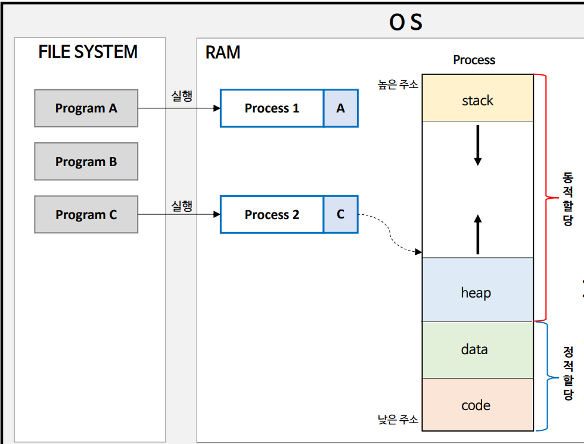
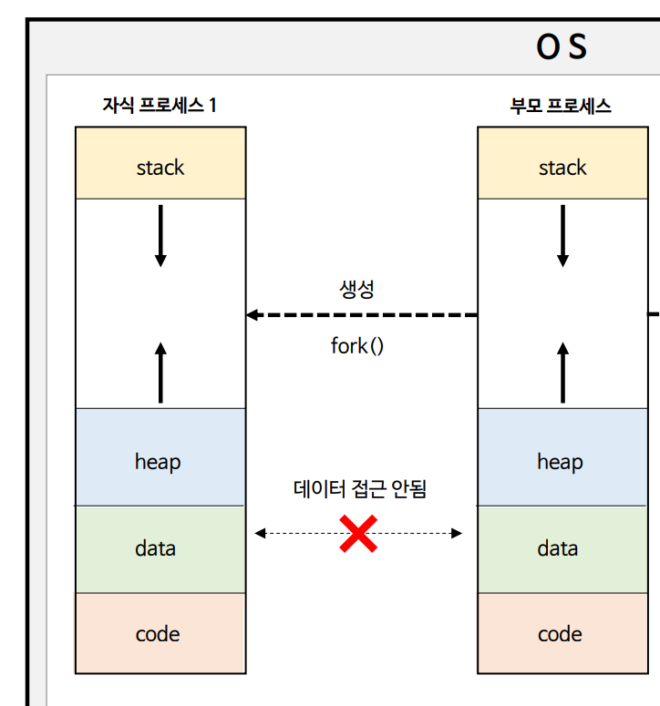
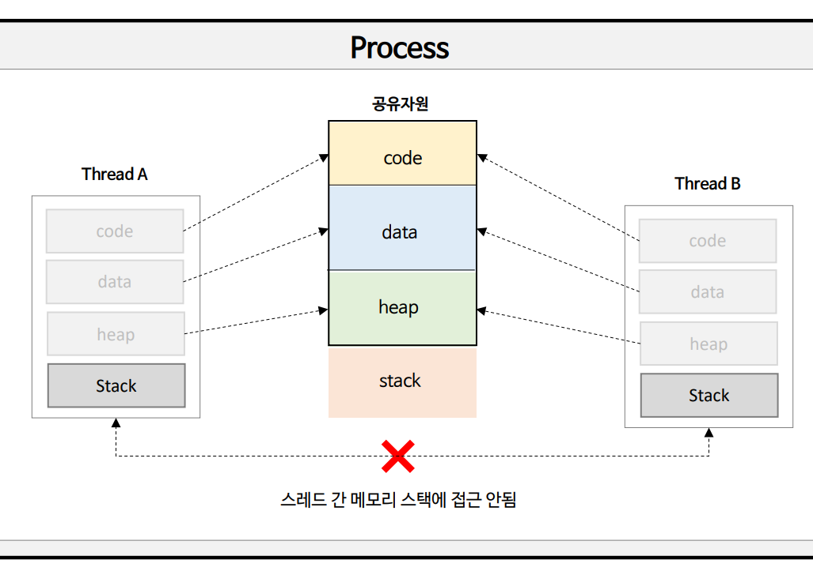

## 🔴 Process?
- CPU 자원을 할당 받아 실행 중인 프로그램을 프로세스라고 한다.
- **운영체제로부터 자원을 할당받은** 최소 작업 단위.

### 프로세스의 구조
- 동적할당
    - **stack** : 함수가 호출되면 스택에 쌓임. 지역변수, 매개변수, 리턴값 등이 저장됨.
    - **heap** : 객체가 저장됨. 
    - stack은 높은 주소에서 낮은 주소로, heap은 낮은 주소에서 높은 주소로 할당된다.
- 정적할당
  - **data** : static 변수 등이 저장. 프로그램이 시작되면 할당된다.
  - **code**

### 프로세스 특징
- 운영체제는 프로세스마다 **독립된 각각의 메모리 영역을 할당**한다. 이로 인해 프로세스 간 영향없이 독립적인 작업을 수행할 수 있다.
  - 각 프로세스는 서로 접근 불가능.
  - 하나의 프로세스가 오류 발생해도 다른 프로세스에는 영향이 미치지 않는다.

## 🔴 Thread?
- 하나의 프로세스는 반드시 하나 이상의 스레드를 갖는다.
- 스레드는 **운영체제의 스케줄러에 의해 관리되는 CPU의** 최소 실행 단위이다.
- 하나의 스레드만 선점되어 CPU에 할당된다.
- 어떤 스레드를 선점할 것인지는 스케줄러가 관리하며, 기존 선점하고 있던 하나의 스레드에서 다른 스레드를 선점하려고 할 때 **컨텍스트 스위칭**(문맥교환)이 발생한다.

### Thread 구조
- 프로세스의 **code, data, heap 영역은 공유**하고, **각 스레드마다 stack 영역을 할당**한다.
  - 스레드 간 stack 영역은 공유할 수 없으며, 이로 인해 스레드는 독립적인 실행 흐름을 가질 수 있다.

| Process                                          | Thread                                                      |
|--------------------------------------------------|-------------------------------------------------------------|
| 하나의 프로세스에 오류가 발생해도 다른 프로세스에 영향을 미치지 않는다.         | 하나의 스레드에 문제가 발생하면 프로세스 자체가 종료될 수 있다.                        |
| 컨텍스트 스위칭시, 레지스터, 캐시메모리 초기화 등 시간적 비용이 많이 발생한다.    | 프로세의 메모리 영역을 공유하기 때문에 컨텍스트 스위칭 소요 시간이 적다.                   |
| 프로세스 간 통신이 불가능하며 통신하려면 복잡한 통신 기법이 필요하며 오버헤드가 크다. | 스레드 간 통신 비용이 적다.                                            |
| 프로세스 생성 시 독립적으로 메모리가 할당되므로 리소스 비용이 크다.           | 스레드는 프로세스의 메모리 영역을 공유하여 리소스 비용이 적지만 이로 인해 동시성 문제가 발생할 수 있다. |

