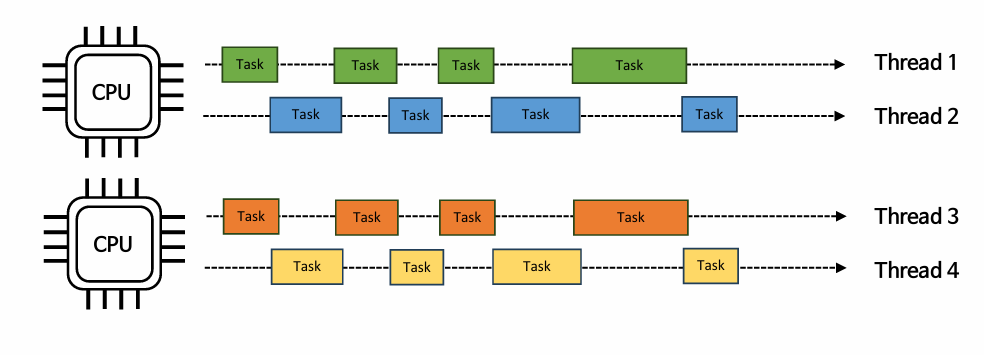

동시성
한 사람이 작업 2개를 한다고 할 때 작업1했다가 작업2했다가 왓다갔다.
순서없음.

병렬성
멀티 코어 프로세서 = 사람 2명. 작업1, 작업2. 사람 2명이 동시에 작업을 실행. 계속 동일한 작업을 진행.

동시성 = 많은 작업들을 어떻게 해야 효율적으로 실행시킬 수 있는가.
병렬성

요즘은 대부분 멀티코어 CPU이다. 병렬성과 동시성 조합.
ThreadPoolExecutor

Parallelism
하나의 테스크를 작게 분할. 나눈 작업은 Thread에 할당. ForkJoinPool.
분할하고 처리하면 합침.

어떤 때 동시성을 활용할 것인가. 어떤 때에 병렬성을 활용할 것인가.

## 🔴 동시성(Concurrency)?
- 동시성은 여러 Task가 동시에 실행되는 것처럼 보이게 하는 **논리적** 개념이다. 그러나 실제로 작업 1,2가 있을 때 CPU는 이 작업 1,2를 번갈아가며(스위칭하며) 실행한다.

- 동시성은 **많은 작업을 CPU가 효율적으로 처리하는 것**에 중점을 둔다.
    - 예를 들어 스레드가 IO 블록에 걸리면 CPU는 다른 스레드로 스위칭하여 작업을 계속 진행한다.
  
- CPU 코어 수보다 작업의 수가 많은 경우 동시성으로 인해 효율적인 처리가 가능해진다.(동시성이 없다면 CPU는 작업을 순서대로 처리할 것이다.)

```java
package io.concurrency.chapter01.exam01;
import java.util.ArrayList;
import java.util.List;

public class ConcurrencyExample {
    public static void main(String[] args) {
        // cpu core 개수 : 16

        // CASE1
        int taskCnt = Runtime.getRuntime().availableProcessors() * 2;

        // CASE2
        //int taskCnt = 17;

        // 작업 생성
        List<Integer> data = new ArrayList<>();
        for (int i = 0; i < taskCnt; i++) {
            data.add(i);
        }

        // CASE1) 총 작업 수 32개, cpu core 16개.
        // 병렬 처리 작업 시간 = 1초

        // CASE2) 총 작업 수 17개, cpu core 16개
        // 병렬 처리 작업 시간 = 1초

        //=> CASE1, CASE2 둘 다 1초 걸림. 즉 작업의 수가 CPU 코어 개수보다 조금 많으면 병렬성의 이점이 줄어듬.

        long startTime2 = System.currentTimeMillis();
        long sum2 = data
                .parallelStream()
                .mapToLong(i -> {
                    try {
                        Thread.sleep(500);
                    } catch (InterruptedException e) {
                        throw new RuntimeException(e);
                    }
                    return i * i;
                })
                .sum();

        long endTime2 = System.currentTimeMillis();

        System.out.println("병렬 처리 작업시간 " + (endTime2 - startTime2) + "ms");
        System.out.println("결과2: " + sum2);
    }
}


```

## 🔴 병렬성(Parallelism)?
- 병렬성은 CPU 코어가 여러 개일 때 코어가 실제로 작업을 동시에 실행하는 **물리적** 개념이다. ex) 동시에 코어1은 작업1 처리하고 코어2는 작업2를 처리한다.
- 병렬성은 **CPU 사용 극대화**에 중점을 둔다. 즉 CPU가 놀지 않고 최대한 바쁘게 동작해야 한다.
- 병렬성은 작업의 수가 CPU의 코어 수보다 같거나 작을 경우 효율성이 좋다.

```java
package io.concurrency.chapter01.exam01;
import java.util.ArrayList;
import java.util.List;

public class ParallelismExample {
    public static void main(String[] args) {
        // cpu core 개수 : 16

        int taskCnt = Runtime.getRuntime().availableProcessors();

        // 작업 생성
        List<Integer> data = new ArrayList<>();
        for (int i = 0; i < taskCnt; i++) {
            data.add(i);
        }

        long startTime1 = System.currentTimeMillis();

        // 하나의 작업 시간 = 0.5초, taskCnt = 16
        // 병렬 처리 안한 경우 총 작업 시간 = 8초
        // 병렬 처리한 경우 총 작업 시간 = 0.5초
        long sum1 = data
                //.stream()
                .parallelStream()
                .mapToLong(i -> {
                    try {
                        Thread.sleep(500);
                    } catch (InterruptedException e) {
                        throw new RuntimeException(e);
                    }
                    return i * i;
                })
                .sum();

        long endTime1 = System.currentTimeMillis();

        System.out.println("CPU 개수만큼 데이터를 병렬로 처리하는 데 걸린 시간: " + (endTime1 - startTime1) + "ms");
        System.out.println("결과1: " + sum1);
    }
}
```

## 🔴 Java의 동시성, 병렬성

### 동시성과 병렬성의 조합 : ThreadPoolExecutor

- 요즘 대부분은 멀티코어 CPU를 사용하므로 병렬성과 동시성을 조합해서 실행하는 구조이다.



- Java의 ThreadPoolExecutor은 병렬성으로 처리 성능을 극대화하고 동시성으로 CPU 자원을 효율적으로 운용한다.

### Divide and Conquer : ForkJoinPool

- Java의 ForkJoinPool은 하나의 태스크를 서브 태스크로 분할하여 병렬처리함으로써 전체 작업 성능을 높인다.

