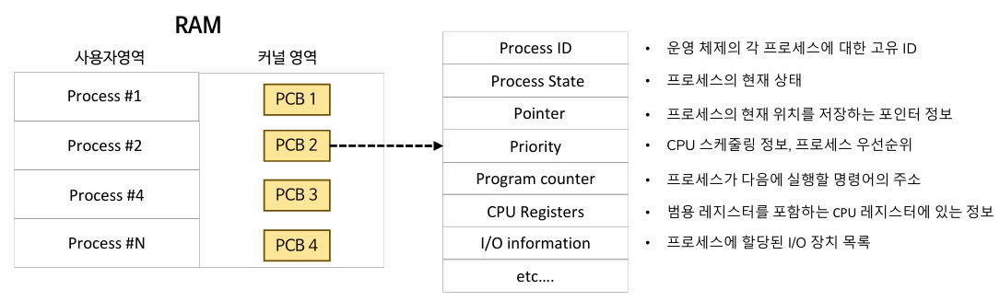
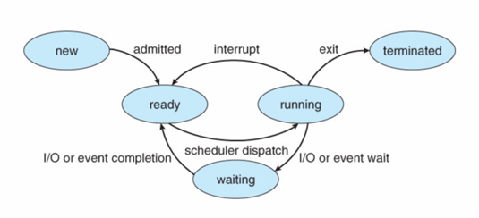

## 🔴 Context Switch(문맥 교환)
- 하나의 CPU는 한번에 하나의 Task만 수행할 수 있다.
- 하나의 CPU에서 여러 프로세스를 동시성으로 처리하기 위해 한 프로세스에서 다른 프로세스로 전환해야 하는데 이 때 **컨텍스트 스위치**가 발생한다.

### 🟡 Context(문맥)?
- CPU가 프로세스를 실행할 때 필요한 프로세스의 정보를 Conext라고 한다.
- Conext는 이전에 어디까지 실행했는지, 레지스터에 어떤 값이 저장되어있는지 등의 정보들을 가지고 있다.
- 이 Context 정보들은 운영체제가 관리하는 PCB에 저장된다.

### 🟡 PCB (Process Control Block)
- 운영체제의 커널 내에 있는 저장공간이며 PCB 안에 프로세스의 context를 저장한다.
- 프로세스마다 각 PCB가 존재한다. ex) Process1 - PCB1, Process2 - PCB2
- 이전 프로세스의 PCB에 PC/레지스터 값을 저장하고, 새로운 프로세스의 PCB에서 PC/레지스터 값을 복원하는 과정을 context switch가 발생했다고 한다.

### 🟡 프로세스 상태

- New (생성상태) : 프로세스 생성함. 커널 영역에 PCB 만들어짐.
- Ready(준비상태) : 프로세스가 CPU 할당받기를 기다리고 있는 상태
- Running (실행상태) : 프로세스가 CPU 할당받고 실행 중인 상태
- Waiting (대기상태): 프로세스가 I/O 작업 완료 또는 특정 이벤트를 기다리는 상태
- Terminated(종료상태) : 프로세스가 종료된 상태

### 🟡 컨텍스트 스위칭이 일어나는 조건
- **running 중인 프로세스가 바뀔 때** context switch가 발생한다.

- **running -> ready** : 다른 프로세스가 running 상태가 되기 때문에 context switch 발생
  - ex) Round Robin 스케줄링에 의해 실행 중인 프로세스가 사용할 수 있는 작업 시간이 모두 소요되면 running -> ready로 전이된다.
- **running -> waiting** : 다른 프로세스가 running 상태가 되므로 context switch 발생
  - ex) 실행 중인 프로세스에서 IO 호출이 일어나서 running -> waiting으로 전이된다.
- **ready -> running** : context switch 발생

### 🟡 컨텍스트 스위칭 동작 과정

- 프로세스1의 PCB1, 프로세스2의 PCB2, 프로세스3의 PCB3
- 프로세스3이 running 상태라고 가정.

1. 스케줄러가 Ready Queue에서 프로세스1를 선택하여 실행. (ready -> running)
    - 실행 중이었던 프로세스3의 PCB3에 프로세스3의 문맥(레지스터, PC)을 저장
    - 프로세스1의 PCB1에서 프로세스1의 문맥 복원
    - ✅ 이것이 context switch 발생!
    - 오버헤드 생김. 이 시간 동안 CPU는 일을 하지 않음.

2. 프로세스1 실행 중 I/O 요청 발생 (running -> waiting)

3. 스케줄러가 다음 실행할 프로세스2을 선택. (ready -> running)
   - 프로세스1의 PCB1에 프로세스1의 문맥을 저장.
   - 프로세스2의 PCB2에서 프로세스2의 문맥 복원.
   - ✅ 이것이 context switch 발생!
   - 오버헤드 생김. 이 시간 동안 CPU는 일을 하지 않음.

## 🔴 Thread Context Switch

### 🟡 TCB (Thread Control Block)
1. TCB는 스레드의 문맥 정보를 저장하는 저장공간이다. PC, Register Set, PCB의 주소를 가진다.
2. **스레드가 하나 생성될 때마다 TCB가 생성된다.**
3. context switch가 발생하면 커널이 기존 스레드의 문맥을 TCB에 저장하고, 새로운 스레드의 TCB에서 문맥을 가져와 실행한다.

## 🔴 Process Context Switch VS Thread Context Switch
- 스레드는 프로세스 내 메모리를 공유하기 때문에 프로세스에 비해 오버헤드가 작아서 컨텍스트 스위칭이 빠르다.
- 그러나 자바 객체에 비해 스레드 생성 비용이 훨씬 크다.
- 스레드의 생성이 많아지면 메모리 부족 현상이 발생하거나 빈번한 컨텍스트 스위칭으로 인해 애플리케이션의 성능이 떨어질 수 있다. 
