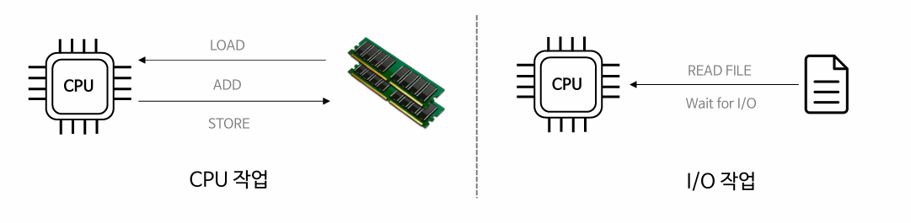

## 🔴 개요
- 프로세스는 CPU 작업과 I/O 작업의 연속된 흐름으로 진행된다.

- 프로세스는 CPU 명령어를 수행하다가 IO를 만나면 대기하고 IO 작업이 완료되면 다시 CPU 작업을 수행한다.

## 🔴 Burst
- 한 작업을 짧은 시간동안 집중적으로 처리하는 것.

### 🟡 CPU Burst
- CPU 연산을 연속으로 집중해서 처리하는 구간.
- 프로세스가 CPU 명령어를 실행하는데 소비하는 시간
- 프로세스의 Running 상태를 처리한다.

### 🟡 I/O Burst
- 연속적으로 IO를 실행하는 구간으로 IO 작업이 수행되는 동안 대기하는 구간.
- 프로세스가 IO 작업 완료를 기다리는 시간
- 프로세스의 Waiting 상태를 처리한다.

=> CPU는 CPU Burst와 I/O Burst를 번갈아가면서 실행한다.

=> 이 두 개의 작업의 비율은 균일하지 않으며 CPU Burst 비율이 많은 건 CPU Bounded Process, I/O Busrt 비율이 더 많으건 I/O Bounded Process라고 부른다.

## 🔴 Bounded Process
### 🟡 CPU Bounded Process
- CPU 연산 작업 위주의 프로세스를 말한다.
- 머신러닝, 블록체인, 동영상 편집 프로그램 등의 경우에 해당.
- **병렬성** 처리가 중요함.
  - 멀티 코어의 병렬성을 최대한 활용해서 성능을 극대화하도록 스레드를 운용해야 함.
  - 일반적으로 **CPU 코어 수와 스레드 수의 비율을 비슷하게 설정한다.**
  - ex) 코어 당 스레드 할당.

### 🟡 I/O Bounded Process
- I/O 작업 위주의 프로세스를 말한다.
- 파일, 키보드, DB, 네트워크 등 외부 연결이나 입출력 장치와의 통신 작업이 많은 경우에 해당.
- **동시성** 처리가 중요함.
  - CPU 코어 개수와 스레드 개수가 동일하다면 I/O 작업이 많기 때문에 대기 상태의 스레드가 많을 것이다. 그럼 그만큼 CPU는 쉬게 되고 효율성이 떨어진다.
  - 최적화된 스레드 수를 운용해서 CPU의 효율적인 사용을 극대화해야 한다.
