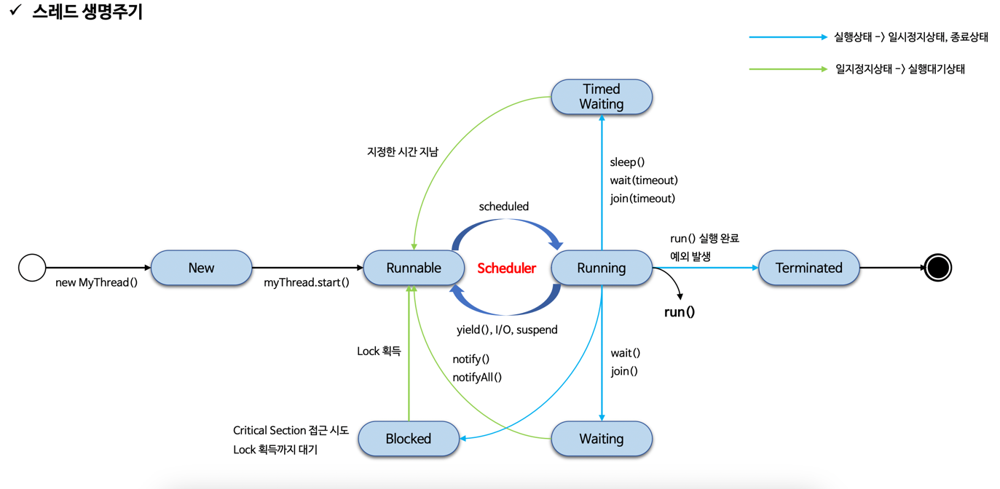

## 1. Thread 생성
- 자바 스레드는 JVM에서 User Thread 생성하고 시스템 콜을 통해 User Thread와 1:1로 매핑되는 Kernel Thread도 생성한다.

### 1-1. Thread 클래스 상속
```java
public class WorkerThread extends Thread {
    @Override
    public void run() {
        // 작업 내용
    }
}

//...


Thread thread = new WorkerThread();
thread.start(); // 스레드 실행
```

### 1-2. Runnable 인터페이스 구현
```java
Thread thread = new Thread(new Runnable() {
    @Override
    public void run() {
        // 작업 내용
    }
});
thread.start(); //스레드 실행

```
## 2. Thread 실행
- 어플리케이션을 실행하면 JVM이 메인 스레드를 자동으로 만들어 실행한다. 메인 스레드 안에서 사용자 스레드가 만들어진다.
- 이 때 메인 스레드가 종료되어도 사용자 스레드가 실행 중이면 어플리케이션은 종료되지 않는다. 이는 스레드마다 각각 스택 영역이 있기에 가능하다.

### 2-1. start()
- start() 내부를 보면 native 메서드인 start0()을 호출하여 시스템 콜을 요청한다.
- 그럼 커널 스레드가 생성된다. 커널 스레드가 실행 상태가 되면 JVM이 이와 매핑된 자바 스레드의 run()을 호출한다.

### 2-2. run()
- 스레드가 start() 메서드를 통해 실행되면 자동으로 호출되는 메서드.
- run() 메서드를 직접 호출하면 새로운 스레드가 생성되는 게 아니라 메서드를 호출한 스레드에서 실행된다.

## 3. Thread 종료
- run()이 모두 실행되면 스레드는 자동으로 종료된다.
- 싱글 스레드 어플리케이션은 메인 스레드만 있다. 메인 스레드가 종료되면 어플리케이션이 종료된다.
- 멀티 스레드 어플리케이션은 메인 스레드와 사용자 스레드가 있다. 메인 스레드 안에서 생성하는 스레드는 모두 사용자 스레드이다. 모든 스레드가 종료되어야 어플리케이션이 종료된다.

## 3. java Thread 6가지 상태
1. NEW : 스레드 객체가 생성됨. 아직 시작되지 않음.
2. RUNNABLE : 실행 중 or 실행 가능한 상태
3. WAITING : 대기 중.
4. TIMED_WAITING : 지정된 시간동안 대기 중.
5. BLOCKED : Lock 해제될 때까지 대기 중.
6. TERMINATED : 실행이 완료됨

## 4. 스레드 생명주기



