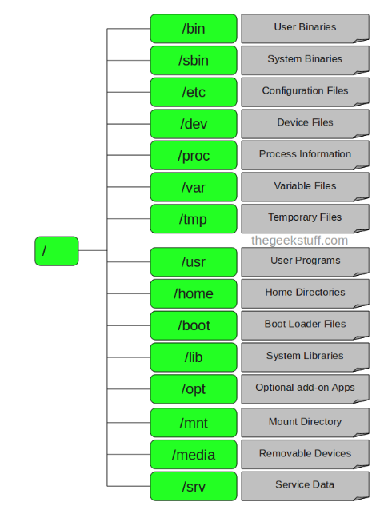

## 🔴 파티션?
- 하드디스크를 논리적으로 나눈 구역. 파티션 별로 파일 시스템을 만듦.
-  윈도우에선 각 파티션마다 드라이브로 지정. ex) C, D 드라이브마다 루트 디렉터리가 있음.
- 리눅스에서는 오직 1개의 루트 디렉터리 존재.
  - 리눅스는 하드디스크나 주변 장치를 파일로 취급함.
  - 저장 장치를 사용하기 위해선 해당 저장 장치 이름을 특정 디렉터리에 마운트시켜야 함.


🔴 🟡
## 🔴 directory structure



| 위치    | 설명                                           |
|-------|----------------------------------------------|
| /     | 모든 파일과 디렉터리의 최상위 디렉터리                        |
| /bin  | 기본적인 명령어가 저장됨.                               |
| /sbin | 부팅 과정이나 시스템 관리에 필요한 명령어가 저장됨.                |
| /etc  | 시스템의 환경 설정 파일을 가짐.                           |
| /dev  | 장치를 접근하는데 사용되는 파일을 가짐.                       |
| /proc | 커널이 사용하는 가상의 파일을 가짐.                         |
| /var  | 가변 자료 저장하는 디렉터리                              |
| /tmp  |                                              |
| /usr  |                                              |
| /home | 사용자 계정 홈 디렉터리가 만들어짐. /home/khe   /home/gusdn |
| /boot |                                              |


## 🔴 파일 찾는 법

```shell
# 데이터베이스에서 파일을 찾음.
$ locate *.log

```

- locate는 데이터베이스에서 파일을 찾는다. 